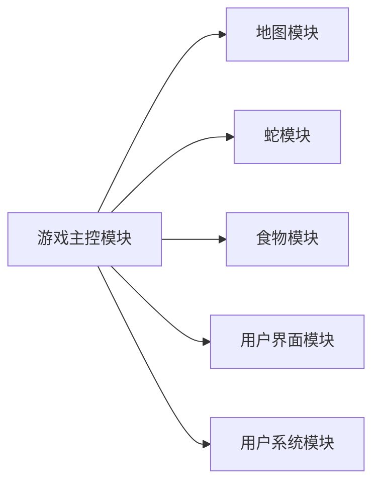
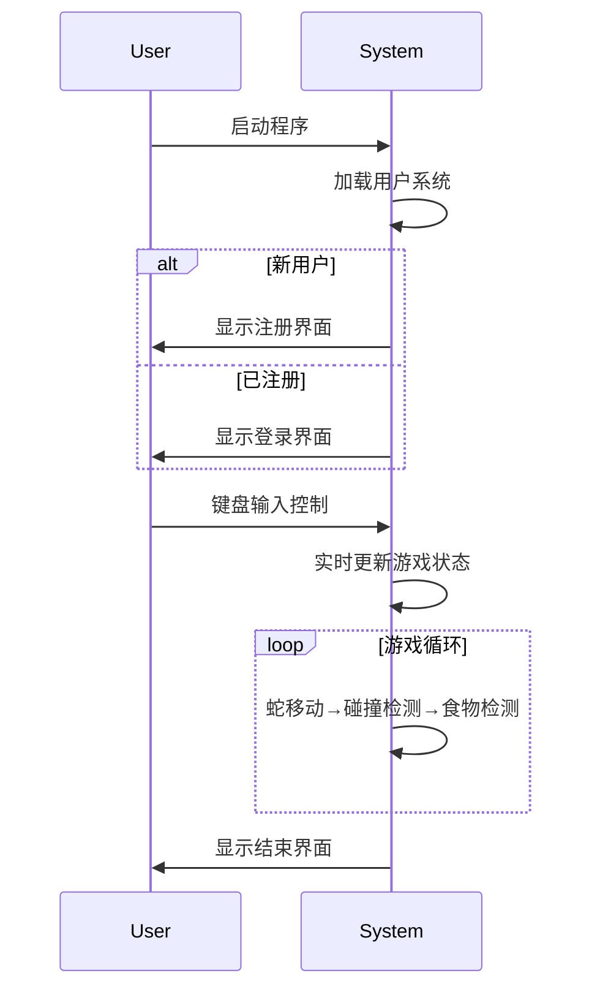

# 贪吃蛇游戏软件分析与设计说明书  
**（软件工程课程项目）**  

---

## 1. 引言  
### 1.1 文档目的  
本文档详细描述基于C++的贪吃蛇游戏的设计与实现，为开发团队及相关利益方提供以下信息：  
- 游戏核心规则与功能  
- 系统架构与模块划分  
- 关键算法与数据流设计  
- 用户交互逻辑  

### 1.2 目标读者  
- 开发团队成员  
- 课程指导教师   

---

## 2. 游戏规则  
1. **初始化状态**  
   - 蛇初始长度为4节，地图内随机生成1个食物  
2. **成长机制**  
   - 每吃1个食物：蛇长度+1，得分+10，速度提升10%  
3. **结束条件**  
   - 蛇头触碰墙壁（地图边界）  
   - 蛇头触碰自身身体  
4. **用户控制**  
   - 方向键（↑↓←→）控制移动方向  
   - 空格键暂停游戏  

---

## 3. 架构设计  
### 3.1 模块划分  


### 3.2 模块职责  
| 模块名称       | 核心功能                               |
|----------------|----------------------------------------|
| 游戏主控模块   | 游戏状态机、输入事件分发、模块协调     |
| 地图模块       | 地图渲染、边界碰撞检测                 |
| 蛇模块         | 移动算法、身体增长、自身碰撞检测       |
| 食物模块       | 随机生成、位置校验（不与蛇/墙重叠）    |
| 用户系统模块   | 注册/登录、游戏数据持久化              |

---

## 4. 功能设计  
### 4.1 核心功能流程图  


### 4.2 关键功能说明  
#### 4.2.1 用户系统  
- **注册流程**  
  ```cpp
  if (新用户) {
      输入用户名/密码 → 加密存储至Users.txt 
      分配唯一UserID
  }
  ```
- **登录验证**  
  采用文件IO比对用户名密码，失败3次锁定账户  

#### 4.2.2 蛇移动算法  
```python
def 移动():
    new_head = 根据当前方向计算新坐标
    if new_head == 食物坐标:
        在链表头部插入新节点（不删除尾节点）
        调用生成新食物()
    else:
        在链表头部插入新节点 → 删除尾节点
    检测碰撞()
```

---

## 5. 项目计划  
### 5.1 开发周期  
| 阶段       | 时间   | 交付物                     |
|------------|--------|----------------------------|
| 核心功能   | 7天    | 可运行的基础游戏版本       |
| 用户系统   | 3天    | 注册/登录/数据持久化       |
| 测试优化   | 4天    | 测试报告+性能优化日志      |

### 5.2 运行要求  
- **开发环境**：Windows + VS2019+  
- **依赖库**：Windows.h（控制台操作）  
- **数据文件**：  
  - `Users.txt`（用户数据库）  
  - `GameLogs.txt`（成绩记录）  

---

## 6.预留接口
```cpp
// 可扩展的游戏存储接口
class IGameSaver {
public:
    virtual void SaveScore(int userID, int score) = 0;
    virtual void LoadLeaderboard() = 0;
};
```
